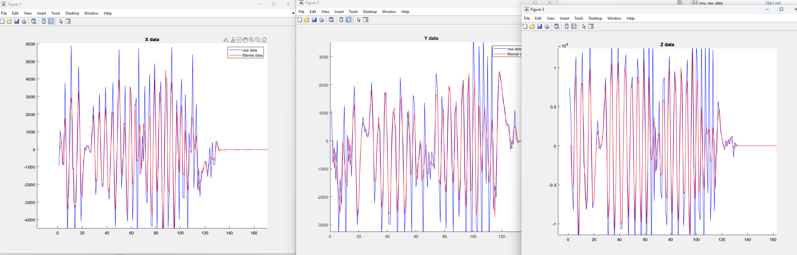

# esp32-techdisc

Kangcheng Chen  
Noah Mecham  
Carly Atwell

## Purpose
This project allows ultimate frisbee players or disc golfers to improve their throws by tracking the rotational speed and angle of the disc as they throw it. The hardware attaches to the bottom of a disc and streams data about the disc's flight over wifi to a web app where we can view the information in real time. Rotational speed and the angle of the disc are impprtant factors in increasing the distance or hang time of a throw, and also important in controlling a disc in the wind, so this tool provides valuable data to anyone looking to improve their disc chucking abilities. 

## Setup 

The MPU6050 is attached via I2C to the ESP32-S2-SAOLA-1 dev kit. The MPU6050 provides acclerometer & gyroscope measurements that are used to calculate the RPM of the disk as well as the tilt angle of the disk. A wiring diagram is provided below.

NOTE: GPIO pin 8 was configured to set the addresss for the connected I2C device.

### Hardware

- ESP32-S2-Saola-1
- MPU6050 
- MicroUSB cable and female-to-female jumper wires

### Software

You can use [PlatformIO](https://platformio.org/) or [ESP-IDF](https://idf.espressif.com/).

If you are using VScode, you can install either of them as a plugin.

- [ESP32-S2 Getting Started Guide](https://docs.espressif.com/projects/esp-idf/en/latest/esp32s2/get-started/index.html)
- [PlatformIO ESP32 Guide](https://docs.platformio.org/en/stable/core/quickstart.html#process-project)

A block diagram detailing the system is provided below:

## Frontend 

The client side app [tech-disc-app](https://github.com/Embedded-Sys-Mini-Project-24spring/tech-disc-app) is an Typescript application running in the browser. It is deployed on [Github pages](https://embedded-sys-mini-project-24spring.github.io/tech-disc-app/) and openly accessible. 

## Data processing

The data from the MPU6050 is read via I2C and processed at an interval of 100ms. This timing is achieved with a timer. The following data is what is read out of the MPU6050:

- Accelerometer data
- Gyroscope data
- Temperature data

Once the data is read, it is passed through a 5 sample Savitzky-Golay smoothing filter. The coefficients used for this filter are as follows:

$$(1/35)(-3*y_{n-2}+12*y_{n-1}+17*y_{n}+12*y_{n+1}-3*y_{n+2})$$

The following plots show the effects of the smoothing filter on obtained gyro data:

After the data has been passed through the smoothing filter we can calculate the RPM and tilt angle. For the RPM calculation we use the degrees/second data returned from the gyroscope in the z-axis. The following equation is used to calculate the RPM from the gyro data:

$$RPM = \omega/6$$

Where $\omega$ is the angular velocity returned by the gyroscope.

The angular tilt is calculated in the following manor. First the angle is calculated based of the gyroscope data. Since the gyroscope returns the angular velocity, we can integrate to get the position or current angle.

$$currentAngleGryo = currentAngleGyro + \omega*\Delta t$$

With $\Delta t$ representing the time between measurments. Which in this application is 100ms.

This formula is used for both the x & y axis data.

Next the accelerometer data can be used to calculate the tilt angle. The following equations were used for those calculations:

$$currentAngleXAcel = arctan(\frac{Accel_x}{\sqrt{Accel_y^2 + Accel_z^2}})*(180/\pi)$$

$$currentAngleXAcel = arctan(\frac{Accel_y}{\sqrt{Accel_x^2 + Accel_z^2}})*(180/\pi)$$

The $180/\pi$ is required to convert from radians to degrees.

Finally the angle calculated from the gyro data is combined with the angle calculated from the accelerometer data. This combination is done using a complementary filter. This filter is implemented using the following algorithm:

$$FinalAngle = \alpha * currnetAngleXGyro + (1-\alpha)*currentAngleXAcel$$

The $\alpha$ is the gain. For this implementation the gain was selected as .85. Meaning we bias towards the gyro data.

The final values are all saved in variables that are returned upon request to be sent or used by a user application.

## Communication

Following the data processing, the data is sent over a websocket to the connected device. The device is connected over the Wifi access point and is running the provided front end application that we have developed. Once connected the user only needs to send the command "cali" using the front end. At this point communiction will begin flowing and the user will see data being ploted. The communication on the ESP is triggered by a timer that expires every 150ms. Providing a data update rate of 6.66 Hz.

Reference:

1. [MPU-6050-Register-Map1.pdf](https://invensense.tdk.com/wp-content/uploads/2015/02/MPU-6000-Register-Map1.pdf)
